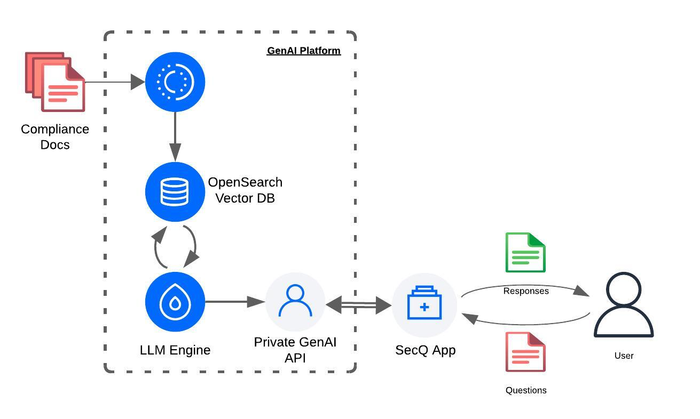

# Digital Ocean's GenAI powered SecurityQ App
OceanEye March 25 project to demo use of GenAI platform

## Introduction
The goal of this app is to demonstrate how DigitalOcean's GenAI platform can be used to create AI-powered applications. \
In this case, we have created a Security Questioneer Answering app that can will fill out a security questionnaire for you. \
The app uses an GenAI RAG agent whose Knoweldge base contains the ficticous company's compliance documents to generate answers to the questions in the questionnaire.

## High Level Design Diagram
